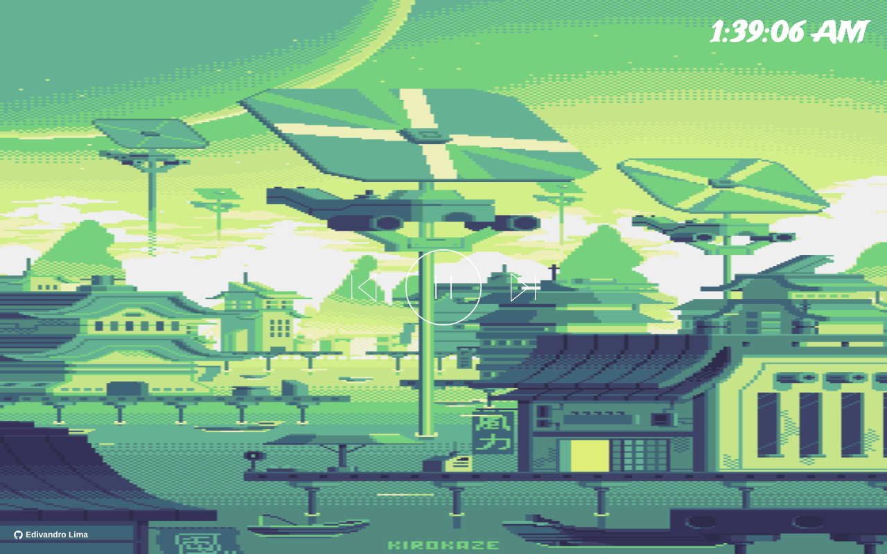

# Lofi Player
Projeto feito para estudo e prática de JavaScript.

É baseado [neste projeto](https://github.com/LaksCastro/lofi-player), achei muito legal e decidi tentar fazer o mesmo, pois estou estudando javaScript.

Todas as imagens pertencem a [este repositório](https://github.com/andumorie/8bitdash.github.io/)

Clique [aqui](https://lofi-player.edivandrolima.vercel.app/) para ver como ficou.

## Ferramentas utilizadas

- [x] HTML
- [x] CSS
- [x] Google Fonts
- [x] JavaScript
- [x] YouTube API IFrame

